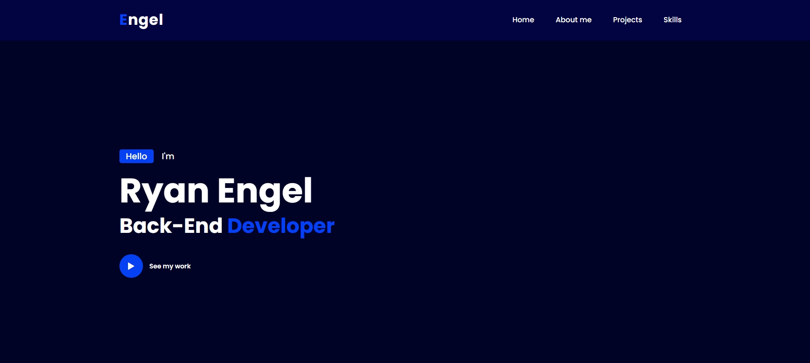
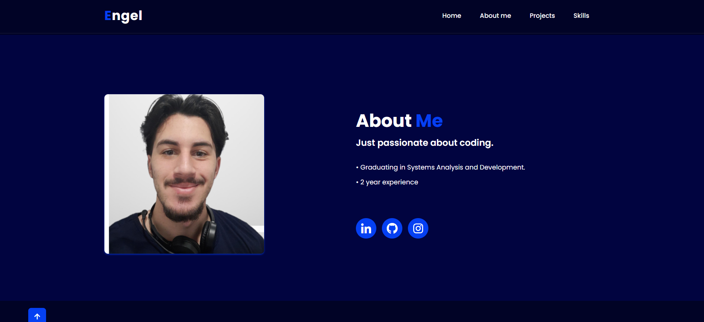
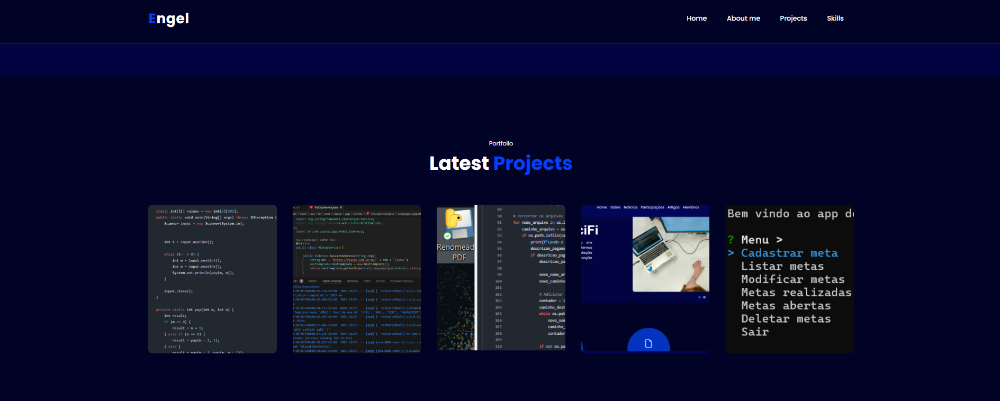

# Portfolio Ryan Engel

Este é o meu portfólio pessoal, onde compartilho um pouco sobre quem sou, minhas habilidades como desenvolvedor e alguns dos projetos que já desenvolvi. O site foi criado com HTML, CSS e JavaScript, com o objetivo de mostrar minhas habilidades em desenvolvimento Front-End.

### 🎯 Tecnologias Utilizadas
- **HTML5**
- **CSS3**
- **JavaScript**

### 📚 Sobre Mim
Sou um desenvolvedor Back-End apaixonado por programação e sempre em busca de novos desafios. Atualmente, estou me formando em Análise e Desenvolvimento de Sistemas e tenho 2 anos de experiência na área.

- **Formação**: Graduando em Análise e Desenvolvimento de Sistemas
- **Experiência**: 2 anos

### 💼 Projetos

Aqui estão alguns dos meus projetos mais recentes:

1. **[URL SHORTENER](https://github.com/EngelRyan/URL-Shortener)**
   - Descrição: Este projeto é um encurtador de URL desenvolvido usando AWS Lambda, S3 e API Gateway.
   - Demonstra minha habilidade em trabalhar com a infraestrutura de nuvem para criar uma solução escalável e eficiente.
   - Tecnologias: AWS Lambda, S3, API Gateway

2. **[SHEET PARSE FLOW](https://github.com/EngelRyan/SheetParseFlow)**
   - Descrição: Programa desenvolvido para filtrar e analisar arquivos PDF e adicionar seus dados automaticamente em uma planilha.
   - Usado para facilitar a extração e organização de informações a partir de documentos PDF.
   - Tecnologias: Python, PDF Parsing, Planilhas

3. **[CHATBOT GROQ](https://github.com/EngelRyan/ChatBot_Groq)**
   - Descrição: Chatbot feito em Python que simula uma conversa com um modelo similar ao GPT, projetado para automatizar processos de interação e fornecer respostas inteligentes com base em um banco de dados de perguntas e respostas.
   - Tecnologias: Python, Inteligência Artificial, Chatbot

4. **[PROMPT CHATS](https://github.com/EngelRyan/Prompt_Chat)**
   - Descrição: Um chatbot de terminal que permite aos usuários interagir com um sistema de perguntas e respostas diretamente pelo terminal, proporcionando uma experiência de interação simples e eficiente.
   - Tecnologias: Python, Inteligência Artificial, Chatbot

5. **[NLW Pocket JavaScript](https://github.com/EngelRyan/NLW_APP)**
   - Descrição: Este projeto faz parte do curso da Rocketseat, onde criei um Gerenciador de Metas utilizando JavaScript e Node.js. Ele permite aos usuários criar, visualizar e gerenciar suas metas de forma simples.
   - Tecnologias: JavaScript, Node.js

### ⚙️ Minhas Habilidades

Algumas das tecnologias com as quais tenho experiência:

- Java
- Spring Boot
- SQL Server
- Docker
- Python
- Django
- JavaScript
- Node.js
- Git
- AWS
- Frameworks Ágeis (Scrum)

### 📸 Imagens do Portfólio

#### Home Section

#### About Me Section

#### Portfolio Section

#### Skills Section

### 🚀 Como Visualizar o Portfólio

Para visualizar meu portfólio basta acessar diretamente o site [aqui](https://engelryan.github.io).

### 📩 Contato

- [LinkedIn](https://www.linkedin.com/in/engelryan/)
- [GitHub](https://github.com/EngelRyan)
